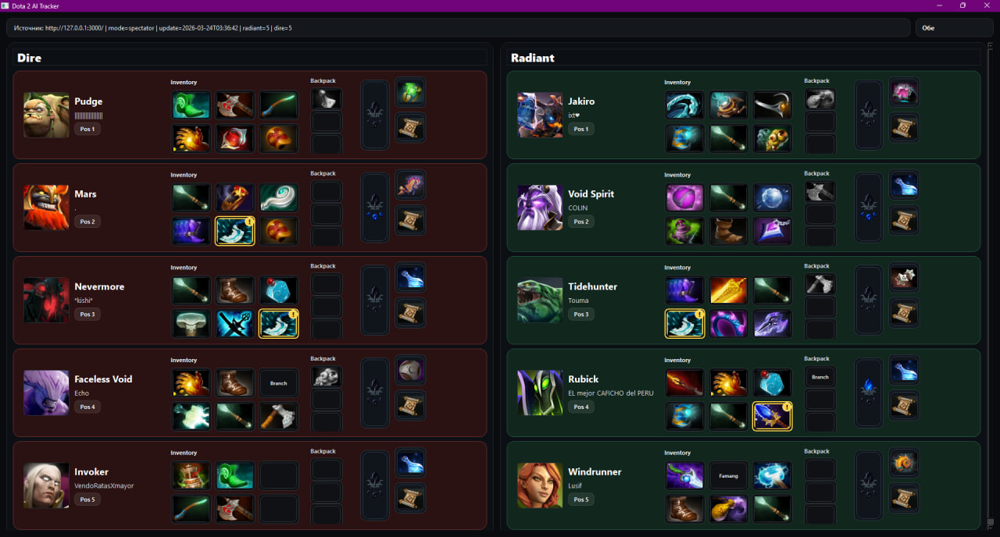

# 🗡️ Dota 2 Live Match Analyzer & AI Tracker

## 📌 Overview
A real-time tactical dashboard for Dota 2 designed to give players a strategic macro-edge. By intercepting live game state data, this tool provides an instant, zero-latency overview of all 10 players' inventories, highlighting critical threats and offering dynamic counter-play recommendations. 

Instead of manually checking enemy items and calculating net worth, the application handles the tactical analysis so the player can focus purely on mechanics and micro-control.

## ✨ Key Features (MVP)
* ⏱️ **Zero-Latency Live Tracking:** Synchronizes live inventory, backpack data, and item states for both Radiant and Dire teams.
* 🎯 **Role-Based UI:** A clean, intuitive dashboard that sorts heroes by their active positions (Pos 1-5) for rapid threat assessment.
* 🔍 **Game State Integration:** Seamless data extraction without interfering with the game client's core processes.

## 🚀 In Active Development (AI Module)
* 🔮 **Predictive Analytics:** An algorithm that calculates enemy net worth and current inventory to predict their next major item purchases.
* 🛡️ **Tactical Assistant:** Automatically highlights high-impact enemy items (e.g., BKB, Blink Dagger) and suggests optimal counter-items tailored to the specific enemy draft.
* ⚔️ **Counter-Pick System:** Draft analysis to suggest the most statistically viable heroes against the enemy lineup.
 

## 🛠️ Tech Stack
* **Language/Backend:** Python
* **Frontend/UI:** PyQt6
* **Data Extraction:** Game State Integration (GSI) / Memory Parsing

---
*Note: This project is a proof-of-concept created for educational purposes and reverse-engineering practice.*
